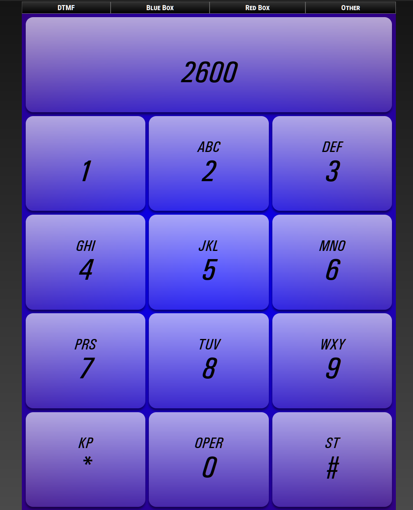

> 🚨 This application is still in actively development and maybe missing features. Check back soon!

# ToneDef (HTML5)

ToneDef is a feature-packed HTML5 tone dialer for desktop and mobile use.

## Usage

-   Use it [online](https://tonedef.network47.org/). It runs entirely on the client side.

## Features

-   [DTMF tone generation](https://en.wikipedia.org/wiki/Dual-tone_multi-frequency_signaling) (with extended A/B/C/D tones)
-   [Blue box tone generation](https://en.wikipedia.org/wiki/Blue_box) (with 2600hz tone)
-   [Red box tone generation](<https://en.wikipedia.org/wiki/Red_box_(phreaking)>) (US and UK)
-   Various international tones

## Building the application

-   TODO

## Acknowledgements

-   Much thanks to [World Tone Database](http://www.3amsystems.com/World_Tone_Database)
-   [Spécifications Techniques d’Interfacepour le réseau de France Télécom](https://www.orange.com/sites/orangecom/files/documents/2020-06/STI03-ed4_0505.pdf)

